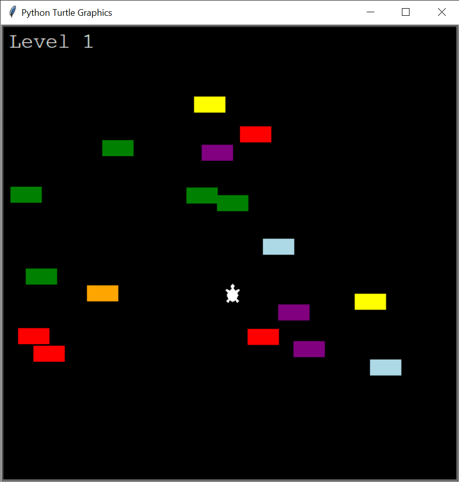

# Traffic Game

Using OOP - inheritance and polymorphism - and the turtle module, I was able to create a fun little minigame. The objective is to make it to the top of the screen using the arrow keys. The user can only go up or down. There are three different difficulties - easy, medium, and hard. Have fun! :)

